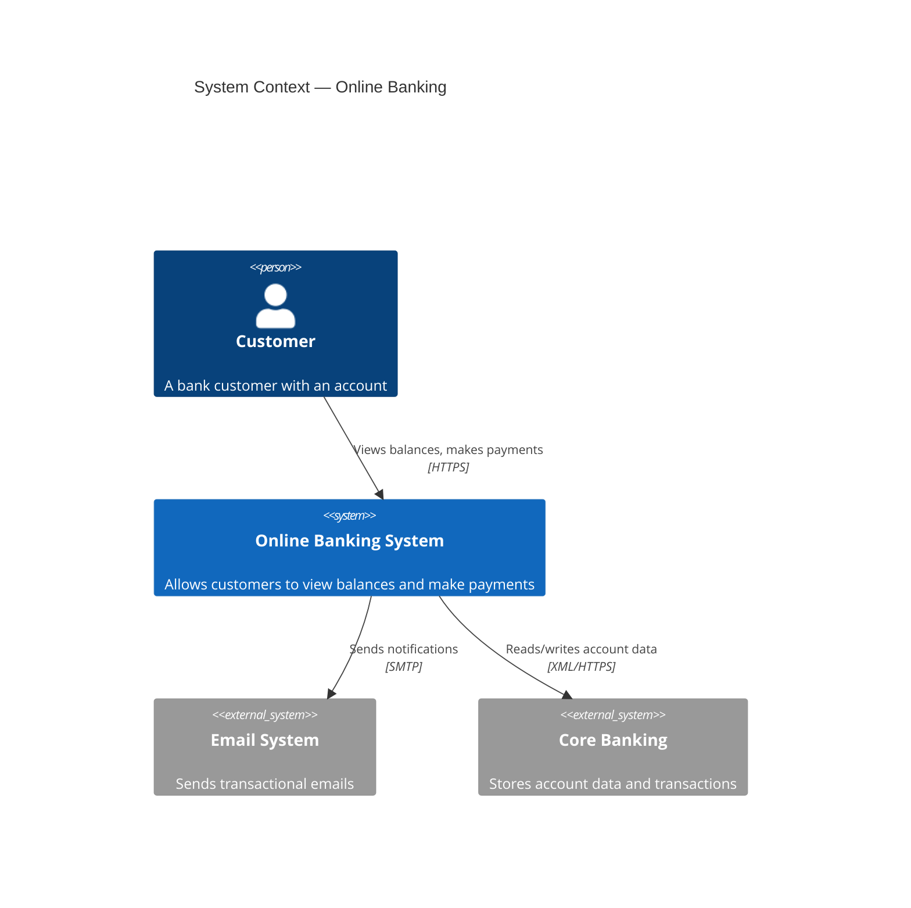
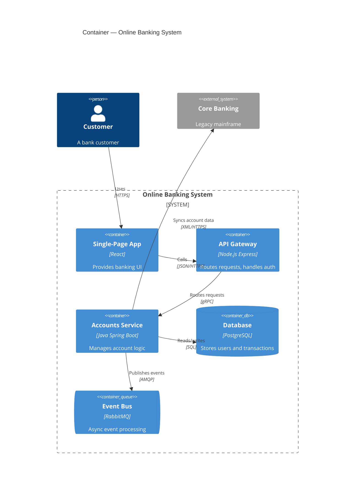
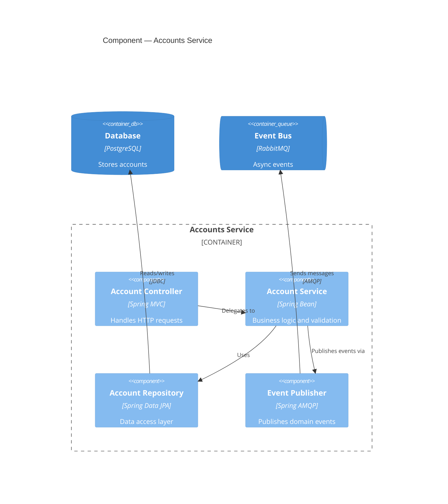

# C4 Model — Mermaid Syntax Reference

## Diagram Types

```
C4Context      — Level 1: System Context
C4Container    — Level 2: Container
C4Component    — Level 3: Component
C4Dynamic      — Numbered interaction flow
C4Deployment   — Infrastructure mapping
```

---

## Elements

### People

```
Person(alias, "Label", "Description")
Person_Ext(alias, "Label", "Description")
```

### Systems (Level 1)

```
System(alias, "Label", "Description")
System_Ext(alias, "Label", "Description")
SystemDb(alias, "Label", "Description")
SystemDb_Ext(alias, "Label", "Description")
SystemQueue(alias, "Label", "Description")
SystemQueue_Ext(alias, "Label", "Description")
```

### Containers (Level 2)

```
Container(alias, "Label", "Technology", "Description")
ContainerDb(alias, "Label", "Technology", "Description")
ContainerQueue(alias, "Label", "Technology", "Description")
Container_Ext(alias, "Label", "Technology", "Description")
ContainerDb_Ext(alias, "Label", "Technology", "Description")
ContainerQueue_Ext(alias, "Label", "Technology", "Description")
```

### Components (Level 3)

```
Component(alias, "Label", "Technology", "Description")
ComponentDb(alias, "Label", "Technology", "Description")
ComponentQueue(alias, "Label", "Technology", "Description")
Component_Ext(alias, "Label", "Technology", "Description")
```

---

## Boundaries

```
Enterprise_Boundary(alias, "Label") {
  ...elements...
}
System_Boundary(alias, "Label") {
  ...elements...
}
Container_Boundary(alias, "Label") {
  ...elements...
}
Boundary(alias, "Label", "type") {
  ...elements...
}
```

---

## Relationships

```
Rel(from, to, "Label", "Technology")
BiRel(from, to, "Label", "Technology")
Rel_U(from, to, "Label", "Technology")   — upward
Rel_D(from, to, "Label", "Technology")   — downward
Rel_L(from, to, "Label", "Technology")   — leftward
Rel_R(from, to, "Label", "Technology")   — rightward
Rel_Back(from, to, "Label", "Technology")
```

For dynamic diagrams (numbered steps):
```
RelIndex(index, from, to, "Label")
```

---

## Styling

```
UpdateElementStyle(alias, $bgColor="blue", $fontColor="white", $borderColor="navy")
UpdateRelStyle(from, to, $textColor="red", $lineColor="red", $offsetX="-40", $offsetY="60")
UpdateLayoutConfig($c4ShapeInRow="3", $c4BoundaryInRow="1")
```

---

## Examples

### Level 1 — System Context



### Level 2 — Container



### Level 3 — Component


