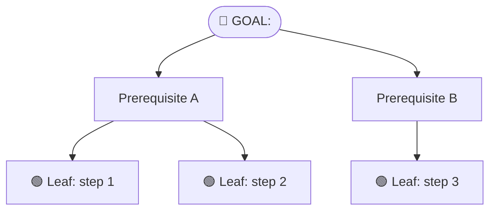

# Mikado Method Skill

A skill for guiding developers through the Mikado Method: a disciplined, graph-driven
approach to safe, incremental refactoring that keeps the codebase in a working state
at all times.

---

## What is the Mikado Method?

Named after the **Pickup Sticks** game (Mikado), where you must remove the topmost
sticks without disturbing the pile before reaching the high-value stick at the bottom.
In software, your **goal** (the "Mikado") sits beneath a pile of dependencies. The
method surfaces those dependencies visually so you can remove them one by one, safely.

---

## Core Definitions

| Term | Meaning |
|---|---|
| **Goal** | The root node. What you ultimately want to achieve. Circle it twice. |
| **Prerequisite** | A dependency that must be resolved before its parent node can be done. |
| **Leaf node** | A node with no further prerequisites. Safe to implement immediately. |
| **Mikado Map** | The full tree of goal + prerequisites. Your "save game" for the refactoring. |
| **Revert** | Undoing all changes to return to a stable state. The map survives; the broken code does not. |

---

## Quick Reference Card

```
MIKADO LOOP
───────────
① Write goal (root) → circle it twice
② Attempt naively in code
③ Every error = a prerequisite bubble
④ REVERT (always, immediately)
⑤ Pick a leaf → repeat from ②
⑥ Leaf passes cleanly → commit → prune
⑦ Repeat until goal is reached

RULES
─────
• Never build on broken code
• One atomic change per commit
• No behavior changes in refactoring commits
• Leaves only touch one concern
• The map is the work — protect it
```

---

## Common Mistakes to Correct

| Mistake | Correction |
|---|---|
| Fixing errors in place instead of reverting | "Revert now. Add these errors as prerequisite nodes instead." |
| Building on top of broken code | "This violates the core rule. Revert to green before continuing." |
| One giant commit with multiple changes | "Split into one commit per leaf node." |
| Skipping the graph for "small" refactors | "Start with even a 3-node graph. It prevents scope creep." |
| Using mocks to avoid test data setup pain | "Use Test Data Builders as Mikado leaf nodes instead." |
| Long-lived refactoring branches | "Work on main. Only commit leaves that don't break anything." |

---

## Output Format

When helping a user apply the Mikado Method, always produce:

### 1. The Mikado Map (Mermaid diagram)

Use 🟢 for current leaves, ⬜ for unreachable prerequisites, ✅ for completed nodes.

### 2. Ordered implementation plan
A numbered list of leaf-first steps, each with the atomic refactoring gesture, a one-line verification test, and the suggested commit message.

### 3. Revert reminder
After any naive attempt: **"Revert now — `git checkout .` — your map is saved, the broken code is not needed."**

---

## Read On Demand

| Read When | File |
|---|---|
| Starting a graph, populating prerequisites, evaluating leaves | [Graph Building](references/graph-building.md) |
| Execution order, committing strategy, legacy code, large refactors, hygiene rules | [Execution & Situations](references/execution-and-situations.md) |
